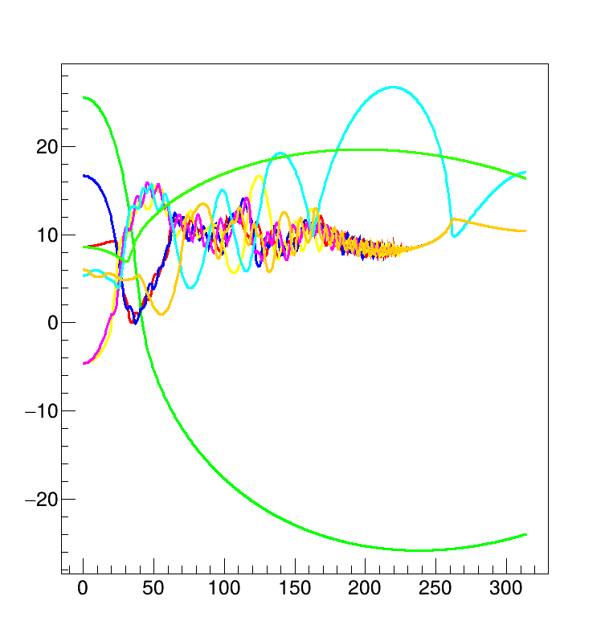

# SolverSuite

## Table of Contents

## Introduction
This project aims to provide implementations of commonly used solvers and relevant data structures and allocators that allow an efficient implementation of the complete system.

This project is highly based on the [Boost Odeint Library](https://www.boost.org/doc/libs/1_82_0/libs/numeric/odeint/doc/html/index.html)

This project is early in its development and is current work in progress.

## Features

### Numerical Solvers
Implemented solvers are:
- **Explicit Generic Runge Kutta**: Explicit generic Runge Kutta implementation. Specializations for common variants will be provided.

### Data Types
- Dynamic array container with lazily evaluated arithmetic operations with the use
of expression templates.
- Eagerly evaluated static array intended for small vector calculations.

## Getting Started

### Prerequisites
This project uses C++23 features and thus, a modern compiler is needed.
CMake 3.30 or better is needed as part of the build system.
ROOT (CERN) ("Root" from now on) is used for plotting, and thus is a requirement for the examples that produce plots.

### Installation

### Building the Project

#### Example - NBody Simualtion

## Usage

## Configuration

## Testing

## Performance

## Contributing

## Documentation

## License
This project is licensed under the [GNU General Public License](./LICENSE).

For more information, please see the [LICENSE](./LICENSE) file.

## Acknowledgments
